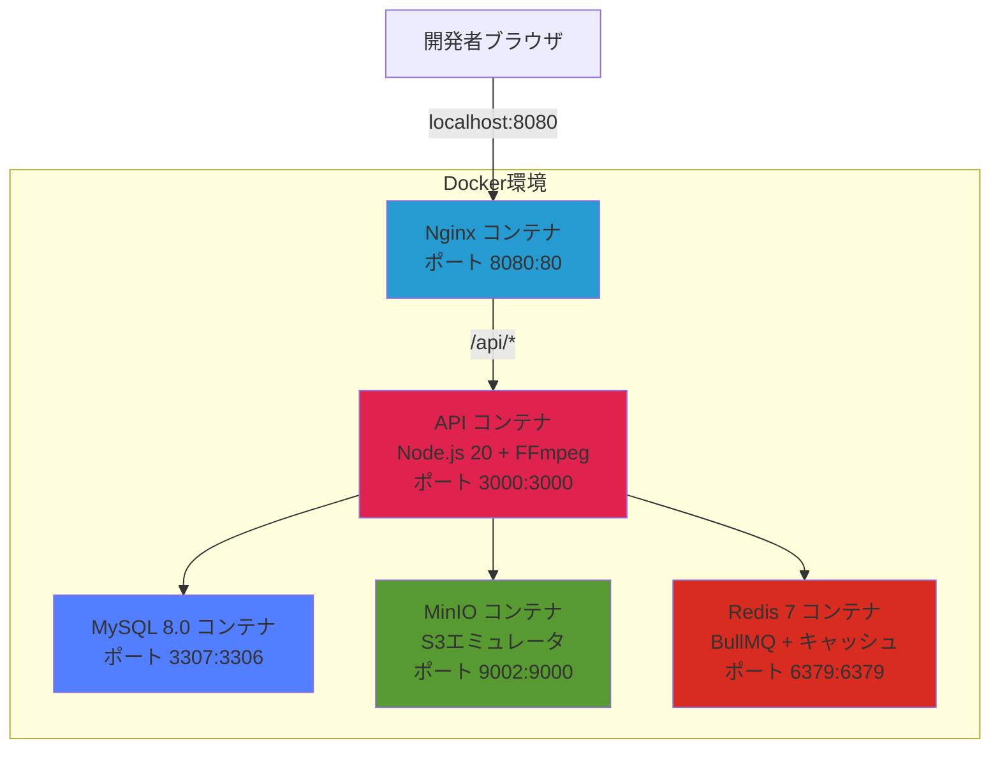

# アーキテクチャ設計書

## 技術スタック
- **フロントエンド**: React 19 + React Router 7 + Tailwind CSS v4
- **ビルドツール**: Vite 7
- **バックエンド**: NestJS 11 + TypeScript + Node.js 20
- **ORM**: Prisma 6
- **データベース**: MySQL 8.0
- **認証**: JWT httpOnly Cookie（Passport + @nestjs/jwt）
- **ジョブキュー**: BullMQ + Redis 7
- **インフラ**: AWS (EC2 + S3 + RDS)
- **ローカル開発環境**: Docker + Docker Compose
- **動画処理**: FFmpeg + fluent-ffmpeg
- **プロセスマネージャー**: PM2（本番環境）
- **テスト**: Jest + supertest（バックエンド）, Vitest + React Testing Library（フロントエンド）

## システム構成図

### 本番環境（AWS）

Laravel版と同一EC2に同居し、RDS・S3を共有する構成。

```mermaid
graph TB
    subgraph "ユーザー"
        Browser[ブラウザ]
    end

    subgraph "AWS環境"
        subgraph "EC2 t3.micro"
            Nginx[Nginx<br/>ポート別振り分け]
            Laravel[PHP-FPM<br/>Laravel版]
            NestJS[PM2 + Node.js 20<br/>NestJS API]
            ReactSPA[React SPA<br/>静的ファイル配信]
            Redis[Redis 7<br/>BullMQ + キャッシュ]
            FFmpeg[FFmpeg<br/>動画エンコード]
        end

        RDS[RDS MySQL 8.0<br/>db.t3.micro<br/>DB: movie_prf]
        S3[S3バケット<br/>動画ストレージ]
    end

    Browser -->|HTTP| Nginx
    Nginx -->|:80| Laravel
    Nginx -->|:8080 /api/*| NestJS
    Nginx -->|:8080 /| ReactSPA
    NestJS --> Redis
    NestJS --> FFmpeg
    NestJS -->|Prisma| RDS
    Laravel -->|Eloquent| RDS
    NestJS -->|@aws-sdk/client-s3| S3
    Browser -->|動画配信| S3

    style Nginx fill:#269bd2
    style NestJS fill:#e0234e
    style Laravel fill:#dc322f
    style ReactSPA fill:#61dafb
    style Redis fill:#d82c20
    style RDS fill:#527FFF
    style S3 fill:#569A31
```

#### Nginx ポート別振り分け構成

1つのNginxプロセスでポート別に両アプリを振り分け:

| ポート | 振り分け先 | 用途 |
|--------|-----------|------|
| `:80` | PHP-FPM :9000 | Laravel版（既存） |
| `:8080 /` | 静的ファイル配信 | React SPA |
| `:8080 /api/*` | Node.js :3000 | NestJS API |

アクセス方法: `http://<EC2パブリックIP>:8080`

#### PM2（プロセスマネージャー）

NestJSアプリケーションのデーモン化・安定稼働を担当:

| 機能 | 説明 |
|------|------|
| デーモン化 | SSHセッション終了後もバックグラウンドで稼働 |
| 自動再起動 | アプリクラッシュ時に自動復旧（最大10回） |
| OS起動時自動起動 | EC2再起動後にPM2が自動でアプリを起動 |
| メモリ制限 | 300MB超過で自動再起動（t3.micro 1GB RAM対策） |
| ログ管理 | `/var/log/pm2/` にアプリログを出力 |

設定ファイル: `ecosystem.config.js`

#### Laravel版との互換性

| 項目 | 互換性 | 詳細 |
|------|--------|------|
| DBスキーマ | 完全一致 | テーブル名・カラム名・外部キー・インデックスすべて同一 |
| bcryptハッシュ | 互換 | 両方ラウンド12 |
| S3パス構造 | 互換 | `users/{userId}/encoded/{videoId}.mp4` |
| 認証方式 | 異なる | Laravel: Session/Cookie、NestJS: JWT httpOnly Cookie |

### ローカル開発環境構成



| サービス | イメージ | ポート（ホスト:コンテナ） | 用途 |
|---------|---------|-------------------------|------|
| api | node:20-slim + FFmpeg | 3000:3000 | NestJS API |
| web | nginx:alpine | 8080:80 | SPA配信 + APIプロキシ |
| db | mysql:8.0 | 3307:3306 | MySQL |
| minio | minio | 9002:9000, 9003:9001 | S3エミュレータ |
| redis | redis:7-alpine | 6379:6379 | BullMQ + キャッシュ |

## 選択理由

### フロントエンド
- **React 19 + Tailwind CSS v4**:
  - コンポーネントベースで再利用性が高い
  - React Router 7 でSPAルーティングを実現
  - Tailwind CSS v4 の `@tailwindcss/vite` プラグインで高速ビルド
  - Vite 7 による高速なHMR開発体験

### バックエンド
- **NestJS 11 + TypeScript**:
  - TypeScriptによる型安全な開発
  - モジュール構成による関心の分離
  - 依存性注入による高いテスタビリティ
  - Prisma ORMで型安全なデータベース操作
  - BullMQ + Redisで非同期ジョブキュー処理

### データベース
- **MySQL 8.0**:
  - Laravel版と同一スキーマを共有
  - Prisma の `@@map` / `@map` でsnake_case DB ↔ camelCase TypeScript を変換
  - RDSで簡単にマネージド運用可能

### 認証
- **JWT httpOnly Cookie**:
  - アクセストークン（15分）+ リフレッシュトークン（7日）
  - httpOnly Cookie でXSSによるトークン窃取を防止
  - Passport + @nestjs/jwt で実装

### インフラ
- **AWS EC2 (t3.micro) に同居**:
  - Laravel版と同一EC2にNode.js + PM2 を追加
  - 追加コスト: ほぼ$0（既存リソースを共有）
  - スワップ領域1GBを追加してメモリ不足を緩和

- **AWS S3**:
  - 動画ファイルの保存・配信に最適
  - パブリック読み取りで直接配信
  - Laravel版と同一バケット・パス構造を共有

- **AWS RDS (db.t3.micro)**:
  - Laravel版と同一データベース `movie_prf` を共有
  - 追加RDSインスタンス不要（コスト削減）

### プロセスマネージャー
- **PM2**:
  - Node.jsアプリのデーモン化に特化
  - クラッシュ時の自動再起動
  - OS起動時の自動起動（`pm2 startup`）
  - メモリ制限による安定稼働（t3.micro対策）
  - ログのファイル出力・ローテーション

### ローカル開発環境
- **Docker + Docker Compose**:
  - ローカル環境と本番環境の差異を最小化
  - MinIOでS3をローカルエミュレート
  - Redis コンテナでBullMQジョブキューをエミュレート

### 動画処理
- **FFmpeg + fluent-ffmpeg**:
  - オープンソースで無料
  - fluent-ffmpeg で Node.js から簡潔に操作
  - BullMQ キューで非同期実行
  - 失敗時は最大3回リトライ

## 本番デプロイ構成

### EC2上のプロセス構成

```
EC2 (t3.micro / 1GB RAM + 1GB Swap)
├── Nginx (1プロセス)
│   ├── :80  → PHP-FPM:9000（Laravel版、既存）
│   └── :8080 → Node.js:3000（NestJS API + React SPA）
├── PHP 8.2 + PHP-FPM（Laravel版、既存）
├── PM2 + Node.js 20
│   └── movie-prf-node（NestJS API、ポート3000）
├── Redis 7（maxmemory 64MB）
└── FFmpeg（動画エンコード）
```

### デプロイフロー

```
ローカル開発 → git push → EC2にSSH → deploy.sh 実行
                                        ├── git pull
                                        ├── frontend: npm ci && npm run build
                                        ├── backend: npm ci && npm run build && prisma generate
                                        ├── pm2 restart
                                        └── ヘルスチェック（curl /api/health）
```

### デプロイ関連ファイル

| ファイル | 用途 |
|---------|------|
| `ecosystem.config.js` | PM2設定（デーモン化、メモリ制限、ログ設定） |
| `deploy/setup.sh` | 初回セットアップ（Node.js/PM2/Redis インストール、スワップ追加） |
| `deploy/deploy.sh` | デプロイスクリプト（ビルド → PM2起動/再起動 → ヘルスチェック） |
| `deploy/nginx/nestjs.conf` | 本番用Nginx設定（バーチャルホスト） |
| `backend/.env.production.example` | 本番環境変数テンプレート |

## 初期コスト（月額）

### 本番環境（AWS）- Laravel版と共有
- **EC2 (t3.micro)**: $7.50/月（既存、追加なし）
- **RDS (db.t3.micro)**: $12.50/月（既存、同一DB共有）
- **S3ストレージ**: $1.00/月（既存、同一バケット共有）
- **S3データ転送**: $1.00/月（想定: 100GB転送）
- **NestJS版の追加コスト**: **ほぼ$0**（既存リソースに同居）
- **合計**: **$22.00/月**（Laravel版と合算）

### 開発環境
- ローカル開発: $0（Docker使用）

### 備考
- 月額目標$30以下を達成可能
- 開発中はEC2/RDSを停止してコスト削減
- t3.micro(1GB RAM)にLaravel + NestJS + Redis同居のため、スワップ1GB必須

## セキュリティ基盤

### SecurityHeadersMiddleware
全HTTPレスポンスに以下のセキュリティヘッダーを自動付与するカスタムミドルウェアを実装:

| ヘッダー | 値 | 目的 |
|---------|-----|------|
| X-XSS-Protection | 1; mode=block | XSS攻撃のブラウザ側検出・ブロック |
| X-Content-Type-Options | nosniff | MIMEタイプスニッフィングの防止 |
| X-Frame-Options | SAMEORIGIN | クリックジャッキングの防止 |
| Referrer-Policy | strict-origin-when-cross-origin | リファラー情報の制御 |
| Permissions-Policy | camera=(), microphone=(), geolocation() | ブラウザ機能へのアクセス制限 |
| Strict-Transport-Security | max-age=31536000; includeSubDomains | HTTPS通信の強制（HTTPS使用時のみ） |

---

## 将来の拡張性

### Phase 2での改善案
- **CloudFront**: S3の前段にCDNを配置し、動画配信を高速化
- **Lambda**: 動画エンコード処理をサーバーレス化
- **ElastiCache**: Redis をマネージドサービスに移行
- **RDS自動バックアップ**: データ保護の強化
- **マルチAZ構成**: 可用性向上（コスト増加）
- **CI/CD**: GitHub Actions でデプロイ自動化

### スケーラビリティ（将来）
- EC2のインスタンスタイプ変更やAuto Scalingで負荷に応じたスケール
- インスタンスのCPUコア増加時は PM2 cluster mode で複数Node.jsプロセスを起動し並列処理
- S3は自動的にスケール
