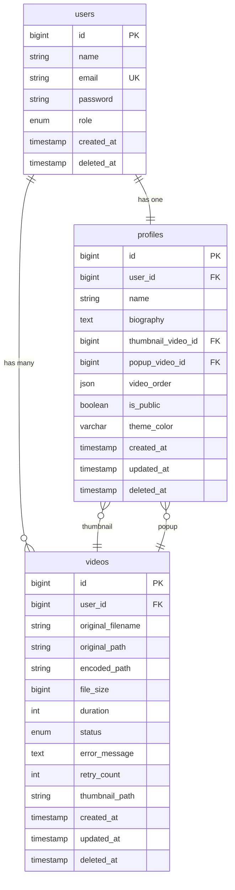

# データベース設計

## テーブル一覧
- **users**: ユーザー認証情報（メールアドレス、パスワード、権限）
- **profiles**: ユーザーのプロフィール情報（名前、経歴、公開ページの内容）
- **videos**: アップロードされた動画の管理（エンコード状態、ファイルパス）

## 主要テーブル DDL

### users テーブル

```sql
CREATE TABLE users (
    id BIGINT UNSIGNED AUTO_INCREMENT PRIMARY KEY,
    name VARCHAR(255) NOT NULL COMMENT 'ユーザー名（Laravel Breeze標準）',
    email VARCHAR(255) NOT NULL UNIQUE COMMENT 'メールアドレス',
    password VARCHAR(255) NOT NULL COMMENT 'ハッシュ化パスワード',
    role ENUM('admin', 'user') DEFAULT 'user' NOT NULL COMMENT 'ユーザー権限',
    email_verified_at TIMESTAMP NULL COMMENT 'メール認証日時（将来機能用）',
    remember_token VARCHAR(100) NULL COMMENT 'ログイン保持トークン',
    created_at TIMESTAMP DEFAULT CURRENT_TIMESTAMP COMMENT '作成日時',
    updated_at TIMESTAMP DEFAULT CURRENT_TIMESTAMP ON UPDATE CURRENT_TIMESTAMP COMMENT '更新日時',
    deleted_at TIMESTAMP NULL COMMENT '論理削除日時',
    INDEX idx_email (email),
    INDEX idx_role (role),
    INDEX idx_deleted_at (deleted_at)
) ENGINE=InnoDB DEFAULT CHARSET=utf8mb4 COLLATE=utf8mb4_unicode_ci COMMENT='ユーザー認証情報';
```

**カラム説明**:
- `id`: ユーザーID（主キー）
- `name`: ユーザー名（Laravel Breeze標準のユーザー名フィールド）
- `email`: ログイン用メールアドレス
- `password`: bcryptでハッシュ化されたパスワード
- `role`: 権限（admin: 管理者, user: 一般ユーザー）
- `email_verified_at`: メール認証済み日時（Phase 2で使用）
- `remember_token`: ログイン状態保持用トークン
- `deleted_at`: ソフトデリート用（30日後に物理削除）

### profiles テーブル

```sql
CREATE TABLE profiles (
    id BIGINT UNSIGNED AUTO_INCREMENT PRIMARY KEY,
    user_id BIGINT UNSIGNED NOT NULL UNIQUE COMMENT 'ユーザーID（外部キー）',
    name VARCHAR(50) NOT NULL COMMENT 'ユーザー名（公開ページ表示名）',
    biography TEXT NULL COMMENT '経歴（最大1000文字）',
    thumbnail_video_id BIGINT UNSIGNED NULL COMMENT 'サムネイル用動画ID',
    popup_video_id BIGINT UNSIGNED NULL COMMENT 'ポップアップ用動画ID',
    video_order JSON NULL COMMENT '動画の表示順序（JSON配列）',
    is_public TINYINT(1) NOT NULL DEFAULT 1 COMMENT 'プロフィール公開状態（1: 公開, 0: 非公開）',
    theme_color VARCHAR(7) NOT NULL DEFAULT '#667eea' COMMENT '公開ページのテーマカラー（HEX）',
    created_at TIMESTAMP DEFAULT CURRENT_TIMESTAMP COMMENT '作成日時',
    updated_at TIMESTAMP DEFAULT CURRENT_TIMESTAMP ON UPDATE CURRENT_TIMESTAMP COMMENT '更新日時',
    deleted_at TIMESTAMP NULL COMMENT '論理削除日時',
    FOREIGN KEY (user_id) REFERENCES users(id) ON DELETE CASCADE,
    FOREIGN KEY (thumbnail_video_id) REFERENCES videos(id) ON DELETE SET NULL,
    FOREIGN KEY (popup_video_id) REFERENCES videos(id) ON DELETE SET NULL,
    INDEX idx_user_id (user_id),
    INDEX idx_is_public (is_public),
    INDEX idx_deleted_at (deleted_at)
) ENGINE=InnoDB DEFAULT CHARSET=utf8mb4 COLLATE=utf8mb4_unicode_ci COMMENT='ユーザープロフィール';
```

**カラム説明**:
- `id`: プロフィールID（主キー）
- `user_id`: 紐づくユーザーID（1対1リレーション）
- `name`: 公開ページに表示される名前（必須、50文字以内）
- `biography`: 経歴テキスト（任意、1000文字以内）
- `thumbnail_video_id`: 常時表示される円形サムネイル動画（任意）
- `popup_video_id`: サムネイルクリック時にカード内でフルカード展開再生される動画（任意）
- `video_order`: 動画の表示順序をJSON配列で保持（任意）
- `is_public`: プロフィール公開状態（true: 公開, false: 非公開、デフォルト: 公開）
- `theme_color`: 公開ページのカード枠・サムネイル枠に反映されるテーマカラー（HEX形式、デフォルト: #667eea）
- `deleted_at`: ソフトデリート用（Laravel SoftDeletesトレイト）

### videos テーブル

```sql
CREATE TABLE videos (
    id BIGINT UNSIGNED AUTO_INCREMENT PRIMARY KEY,
    user_id BIGINT UNSIGNED NOT NULL COMMENT 'アップロードユーザーID',
    original_filename VARCHAR(255) NOT NULL COMMENT '元ファイル名',
    original_path VARCHAR(500) NULL COMMENT '元動画のS3パス（エンコード後削除）',
    encoded_path VARCHAR(500) NULL COMMENT 'エンコード済み動画のS3パス',
    file_size BIGINT UNSIGNED NULL COMMENT 'ファイルサイズ（バイト）',
    duration INT UNSIGNED NULL COMMENT '動画の長さ（秒）',
    status ENUM('uploading', 'encoding', 'completed', 'failed') DEFAULT 'uploading' NOT NULL COMMENT 'エンコード状態',
    error_message TEXT NULL COMMENT 'エンコード失敗時のエラー内容',
    retry_count TINYINT UNSIGNED DEFAULT 0 COMMENT 'エンコードリトライ回数',
    thumbnail_path VARCHAR(500) NULL COMMENT 'サムネイル画像パス',
    created_at TIMESTAMP DEFAULT CURRENT_TIMESTAMP COMMENT '作成日時',
    updated_at TIMESTAMP DEFAULT CURRENT_TIMESTAMP ON UPDATE CURRENT_TIMESTAMP COMMENT '更新日時',
    deleted_at TIMESTAMP NULL COMMENT '論理削除日時',
    FOREIGN KEY (user_id) REFERENCES users(id) ON DELETE CASCADE,
    INDEX idx_user_id (user_id),
    INDEX idx_status (status),
    INDEX idx_deleted_at (deleted_at)
) ENGINE=InnoDB DEFAULT CHARSET=utf8mb4 COLLATE=utf8mb4_unicode_ci COMMENT='動画管理';
```

**カラム説明**:
- `id`: 動画ID（主キー）
- `user_id`: アップロードしたユーザーID
- `original_filename`: ユーザーがアップロードした元のファイル名
- `original_path`: S3に保存された元動画のパス（エンコード完了後削除）
- `encoded_path`: エンコード後の動画S3パス（公開配信用）
- `file_size`: 動画ファイルサイズ（バイト単位）
- `duration`: 動画の長さ（秒、60秒以内制限）
- `status`: エンコード処理の状態
  - `uploading`: アップロード中
  - `encoding`: エンコード処理中
  - `completed`: エンコード完了（公開可能）
  - `failed`: エンコード失敗
- `error_message`: エンコード失敗時のエラー詳細
- `retry_count`: エンコードリトライ回数（最大3回）
- `thumbnail_path`: 動画のサムネイル画像パス（任意）
- `deleted_at`: ソフトデリート用（Laravel SoftDeletesトレイト）

## リレーション

### ユーザーとプロフィール（1対1）
- `profiles.user_id` → `users.id`（1ユーザーに1プロフィール）
- ユーザー削除時はプロフィールもカスケード削除

### ユーザーと動画（1対多）
- `videos.user_id` → `users.id`（1ユーザーが複数動画を所有可能）
- ユーザー削除時は動画もカスケード削除（S3ファイルも削除）

### プロフィールと動画（多対1）
- `profiles.thumbnail_video_id` → `videos.id`（サムネイル用動画）
- `profiles.popup_video_id` → `videos.id`（ポップアップ用動画）
- 動画削除時はNULLに設定（SET NULL）

## ER図（概念図）



## インデックス設計

### users テーブル
- `PRIMARY KEY (id)`: 主キー
- `UNIQUE KEY (email)`: ログイン時の高速検索
- `INDEX (role)`: 管理者一覧取得時の絞り込み
- `INDEX (deleted_at)`: ソフトデリート除外クエリの最適化

### profiles テーブル
- `PRIMARY KEY (id)`: 主キー
- `UNIQUE KEY (user_id)`: 1ユーザー1プロフィールの保証
- `INDEX (user_id)`: ユーザーからプロフィール取得の高速化
- `INDEX (is_public)`: 公開ページ一覧取得時の絞り込み
- `INDEX (deleted_at)`: ソフトデリート除外クエリの最適化

### videos テーブル
- `PRIMARY KEY (id)`: 主キー
- `INDEX (user_id)`: ユーザーの動画一覧取得の高速化
- `INDEX (status)`: エンコードキュー処理の絞り込み
- `INDEX (deleted_at)`: ソフトデリート除外クエリの最適化

## データ削除ポリシー

### ユーザー削除時
1. `users.deleted_at`に削除日時を記録（ソフトデリート）
2. 30日後にバッチ処理で物理削除
3. プロフィールと動画は外部キー制約でカスケード削除
4. S3の動画ファイルもアプリケーション側で削除

### 動画削除時
1. 動画レコードを削除
2. S3の動画ファイル（original_path, encoded_path）を削除
3. プロフィールの参照はNULLに設定

## 備考

### 文字コード
- `utf8mb4`: 絵文字対応のため
- `utf8mb4_unicode_ci`: 大文字小文字を区別しない照合順序

### タイムスタンプ
- Laravelの規約に従い `created_at`, `updated_at` を使用
- `deleted_at` はソフトデリート用（Laravel SoftDeletesトレイト）

### ソフトデリート
- users, profiles, videos の全3テーブルでソフトデリート（`deleted_at`）を使用
- Laravel SoftDeletesトレイトにより、`delete()` 時に `deleted_at` にタイムスタンプが記録される
- 通常のクエリではソフトデリート済みレコードは自動的に除外される
- ユーザー削除後30日間はデータ保持、バッチ処理で物理削除

### 将来の拡張
- **sessionsテーブル**: セッション管理をDBに移行する場合
- **password_reset_tokensテーブル**: パスワードリセット機能実装時
- **failed_jobsテーブル**: キュー処理の失敗ログ管理
- **notificationsテーブル**: ユーザー通知機能実装時
