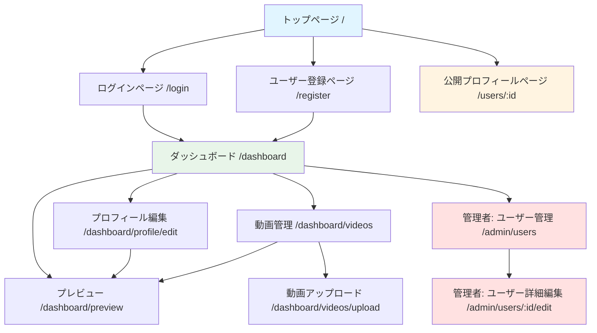

# サイトマップ

## ページ構成図

## ページ一覧

### トップページ (`/`)
**認証**: 不要
**説明**: サービスの紹介とユーザー登録・ログインへの導線を提供
**主要コンポーネント**:
- サービス概要説明
- 新規登録ボタン
- ログインボタン
- サンプル公開ページへのリンク

**遷移先**:
- ユーザー登録ページ (`/register`) - 新規登録ボタンクリック時
- ログインページ (`/login`) - ログインボタンクリック時
- 公開プロフィールページ (`/users/:id`) - サンプルリンククリック時

---

### ユーザー登録ページ (`/register`)
**認証**: 不要（未認証ユーザー向け）
**説明**: 新規ユーザーのアカウント登録
**主要コンポーネント**:
- 名前入力フォーム
- メールアドレス入力フォーム
- パスワード入力フォーム（確認用含む）
- 登録ボタン
- 既存アカウントでログインリンク

**遷移先**:
- ダッシュボード (`/dashboard`) - 登録成功時
- ログインページ (`/login`) - 既にアカウントを持っている場合

**備考**:
- Laravel Breezeの標準登録フォームを使用
- バリデーション: メールアドレス形式、パスワード8文字以上

---

### ログインページ (`/login`)
**認証**: 不要（未認証ユーザー向け）
**説明**: 既存ユーザーのログイン
**主要コンポーネント**:
- メールアドレス入力フォーム
- パスワード入力フォーム
- ログインボタン
- ログイン状態を保持するチェックボックス（Remember Me）
- 新規登録リンク

**遷移先**:
- ダッシュボード (`/dashboard`) - ログイン成功時
- ユーザー登録ページ (`/register`) - アカウントを持っていない場合

**備考**:
- Laravel Breezeの標準ログインフォームを使用
- パスワードリセット機能はBreeze標準として実装済み（`/forgot-password`）

---

### 公開プロフィールページ (`/users/:id`)
**認証**: 不要
**説明**: ユーザーの自己紹介ページ（一般公開）
**主要コンポーネント**:
- ユーザー名表示
- 経歴テキスト表示
- サムネイル用動画（円形、画面右下、自動ループ再生、ミュート）
- ポップアップ用動画（モーダル、クリック時に表示、音声あり）

**遷移先**:
- なし（閲覧専用ページ）

**備考**:
- URLパラメータ `:id` でユーザーを特定
- 動画が未設定の場合はプレースホルダー表示
- MVP版では全ページ公開（公開/非公開切り替えはPhase 2）

---

### ダッシュボード (`/dashboard`)
**認証**: 必要（一般ユーザー、管理者）
**説明**: ログイン後のメイン画面、各機能へのナビゲーション
**主要コンポーネント**:
- 現在のプロフィール状態表示
- プロフィール編集リンク
- 動画管理リンク
- プレビューリンク
- 自分の公開ページへのリンク
- ログアウトボタン
- 管理者のみ: ユーザー管理リンク

**遷移先**:
- プロフィール編集 (`/dashboard/profile/edit`) - 編集ボタンクリック時
- 動画管理 (`/dashboard/videos`) - 動画管理ボタンクリック時
- プレビュー (`/dashboard/preview`) - プレビューボタンクリック時
- 公開プロフィールページ (`/users/:id`) - 公開ページ確認時
- 管理者ユーザー管理 (`/admin/users`) - 管理者のみ

**備考**:
- Laravel Breezeの標準ダッシュボードをベースにカスタマイズ

---

### プロフィール編集 (`/dashboard/profile/edit`)
**認証**: 必要（一般ユーザー、管理者）
**説明**: 自分のプロフィール情報を編集
**主要コンポーネント**:
- 名前入力フォーム（必須、50文字以内）
- 経歴入力フォーム（任意、1000文字以内、テキストエリア）
- サムネイル用動画選択（ドロップダウン）
- ポップアップ用動画選択（ドロップダウン）
- テーマカラー選択（プリセット8色カラーパレット）
- 保存ボタン
- キャンセルボタン

**遷移先**:
- ダッシュボード (`/dashboard`) - 保存成功時またはキャンセル時
- プレビュー (`/dashboard/preview`) - プレビューボタンクリック時

**備考**:
- バリデーション: 名前必須、経歴1000文字以内
- 動画が未アップロードの場合は選択肢なし

---

### 動画管理 (`/dashboard/videos`)
**認証**: 必要（一般ユーザー、管理者）
**説明**: 自分がアップロードした動画の一覧と管理
**主要コンポーネント**:
- 動画アップロードボタン
- 動画一覧テーブル（サムネイル、ファイル名、ステータス、アクション）
- 各動画の削除ボタン
- エンコード中の進捗表示

**遷移先**:
- 動画アップロード (`/dashboard/videos/upload`) - アップロードボタンクリック時
- ダッシュボード (`/dashboard`) - 戻るボタンクリック時

**備考**:
- ステータス表示: uploading, encoding, completed, failed
- エンコード失敗時はエラーメッセージ表示

---

### 動画アップロード (`/dashboard/videos/upload`)
**認証**: 必要（一般ユーザー、管理者）
**説明**: 新しい動画をアップロード
**主要コンポーネント**:
- ファイル選択フォーム
- アップロードボタン
- 制限事項の表示（100MB以内、1分以内、対応形式）
- アップロード進捗バー

**遷移先**:
- 動画管理 (`/dashboard/videos`) - アップロード完了時

**備考**:
- バリデーション: ファイルサイズ100MB以内、動画長さ1分以内
- 対応フォーマット: mp4, mov, avi, wmv
- アップロード後、自動的にエンコードキューに追加

---

### プレビュー (`/dashboard/preview`)
**認証**: 必要（一般ユーザー、管理者）
**説明**: 公開前に自分のプロフィールページをプレビュー
**主要コンポーネント**:
- 公開プロフィールページと同じレイアウト
- 「これは下書き状態です」という注意書き
- 編集ページへ戻るボタン

**遷移先**:
- プロフィール編集 (`/dashboard/profile/edit`) - 編集ボタンクリック時
- ダッシュボード (`/dashboard`) - ダッシュボードへ戻るボタンクリック時

**備考**:
- 実際の公開ページ表示をシミュレート

---

### 管理者: ユーザー管理 (`/admin/users`)
**認証**: 必要（管理者のみ）
**説明**: 全ユーザーの一覧と管理
**主要コンポーネント**:
- ユーザー一覧テーブル（ID, メール, 名前, 権限, 作成日時）
- 各ユーザーの編集ボタン
- 各ユーザーの削除ボタン
- 検索フィルター

**遷移先**:
- 管理者: ユーザー詳細編集 (`/admin/users/:id/edit`) - 編集ボタンクリック時
- ダッシュボード (`/dashboard`) - ダッシュボードへ戻る

**備考**:
- 管理者以外はアクセス不可（403エラー）

---

### 管理者: ユーザー詳細編集 (`/admin/users/:id/edit`)
**認証**: 必要（管理者のみ）
**説明**: 特定ユーザーのプロフィールを編集
**主要コンポーネント**:
- プロフィール編集フォーム（一般ユーザーと同じ）
- 権限変更ドロップダウン（admin / user）
- アカウント有効化/無効化ボタン
- 保存ボタン

**遷移先**:
- 管理者: ユーザー管理 (`/admin/users`) - 保存後

**備考**:
- 管理者は全ユーザーのプロフィールを編集可能

---

## ユーザーフロー

### 未認証ユーザー（閲覧のみ）
1. トップページ (`/`) にアクセス
2. サンプルリンクから公開プロフィールページ (`/users/:id`) を閲覧

### 新規ユーザー（初めて利用）
1. トップページ (`/`) → ユーザー登録ページ (`/register`)
2. アカウント作成 → ダッシュボード (`/dashboard`)
3. プロフィール編集 (`/dashboard/profile/edit`) → 名前・経歴入力
4. 動画アップロード (`/dashboard/videos/upload`) → サムネイル・ポップアップ用動画をアップロード
5. 動画管理 (`/dashboard/videos`) → エンコード完了を確認
6. プロフィール編集 (`/dashboard/profile/edit`) → アップロード済み動画を選択
7. プレビュー (`/dashboard/preview`) → 公開前確認
8. 公開プロフィールページ (`/users/:id`) → 自分のページを確認

### 既存ユーザー（ログイン後の編集）
1. ログインページ (`/login`) → ダッシュボード (`/dashboard`)
2. プロフィール編集 (`/dashboard/profile/edit`) → 内容を更新
3. 動画管理 (`/dashboard/videos`) → 動画を追加/削除
4. プレビュー (`/dashboard/preview`) → 変更を確認
5. 公開プロフィールページ (`/users/:id`) → 更新後のページを確認

### 管理者
1. ログインページ (`/login`) → ダッシュボード (`/dashboard`)
2. 管理者: ユーザー管理 (`/admin/users`) → 全ユーザーを確認
3. 管理者: ユーザー詳細編集 (`/admin/users/:id/edit`) → 特定ユーザーを編集/削除

## 共通コンポーネント

### ヘッダー（全ページ共通）
- サービスロゴ/タイトル
- ナビゲーションメニュー
  - 未認証時: ホーム、ログイン、新規登録
  - 認証時: ダッシュボード、マイページ、ログアウト
  - 管理者のみ: ユーザー管理

### フッター（全ページ共通）
- コピーライト表記
- プライバシーポリシーリンク（Phase 2）
- 利用規約リンク（Phase 2）

## 補足事項

### MVP版の制限
- 全ての自己紹介ページは公開状態（公開/非公開切り替えはPhase 2）
- メール認証なし（Phase 2で実装）

**注記**: パスワードリセット機能はLaravel Breeze標準として実装済み（`/forgot-password`, `/reset-password/{token}`）

### Phase 2での拡張予定
- 公開/非公開切り替え設定ページ（UIトグル実装）
- アクセス解析ページ (`/dashboard/analytics`)
- 独自ドメイン設定ページ

### アクセス制御
- 未認証ユーザー: トップ、登録、ログイン、公開プロフィールのみ
- 一般ユーザー: ダッシュボード、プロフィール編集、動画管理、プレビュー
- 管理者: 一般ユーザーの権限 + ユーザー管理機能
