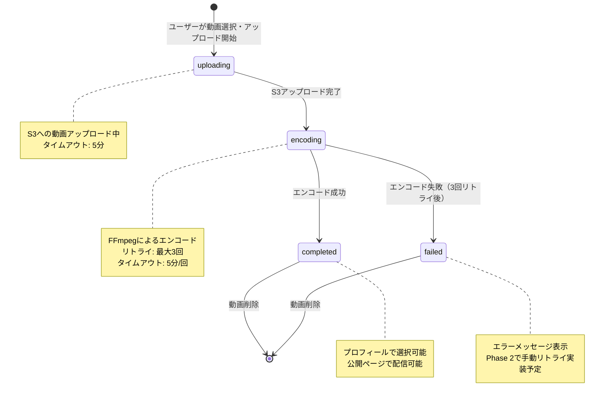

# 状態遷移設計書（動画）

## ステータス定義

| ステータス | 値 | 説明 | ユーザー表示 |
|------------|-----|------|-------------|
| アップロード中 | `uploading` | S3への動画アップロード中 | 「アップロード中...」+ プログレスバー |
| エンコード中 | `encoding` | FFmpegによるエンコード処理中 | 「エンコード中...」+ スピナー |
| 完了 | `completed` | エンコード完了、使用可能 | 「使用可能」+ 緑色のチェックマーク |
| 失敗 | `failed` | エンコード失敗（3回リトライ後） | 「エンコード失敗」+ エラーアイコン |

---

## 状態遷移図



---

## 状態遷移詳細

### [初期状態] → uploading
**遷移条件**: ユーザーが動画アップロードフォームで動画を選択し、送信ボタンをクリック
**処理内容**:
1. バリデーション（ファイルサイズ100MB以内、動画長さ1分以内、形式チェック）
2. `videos`テーブルにレコード作成（status: `uploading`）
3. S3へのアップロード開始
**想定時間**: 10秒〜3分（動画サイズによる）

---

### uploading → encoding
**遷移条件**: S3への動画アップロードが完了
**処理内容**:
1. `videos.original_path`にS3パスを保存
2. `videos.status`を`uploading`から`encoding`に更新
3. エンコードジョブ（FFmpeg）を開始
**想定時間**: 即座（数秒）

---

### encoding → completed
**遷移条件**: FFmpegによるエンコードが成功
**処理内容**:
1. エンコード済み動画をS3にアップロード（`encoded_path`）
2. 元動画をS3から削除（`original_path`）
3. `videos.status`を`encoding`から`completed`に更新
4. `videos.file_size`、`videos.duration`を保存
**想定時間**: 30秒〜5分（動画の長さと解像度によるが、最大1分の動画なので通常1〜2分程度）

---

### encoding → failed
**遷移条件**: FFmpegによるエンコードが3回失敗
**処理内容**:
1. エンコード失敗を検知
2. `videos.retry_count`をインクリメント
3. retry_count < 3 ならエンコード再試行
4. retry_count >= 3 なら:
   - `videos.status`を`encoding`から`failed`に更新
   - `videos.error_message`にエラー内容を保存
   - ユーザーに通知（セッションフラッシュメッセージ）
**想定時間**: 各リトライで5分タイムアウト × 3回 = 最大15分

---

### completed → [初期状態]
**遷移条件**: ユーザーが動画削除ボタンをクリック
**処理内容**:
1. プロフィールで使用中でないかチェック
2. 使用中の場合:
   - `force_delete` フラグなし → 確認メッセージを表示（プロフィール参照クリアの確認）
   - `force_delete` フラグあり → プロフィールの `thumbnail_video_id`、`popup_video_id` をNULLにクリアしてから削除続行
3. 使用されていない場合:
   - S3から`encoded_path`を削除
   - `videos`テーブルからレコード削除（ソフトデリート）
**想定時間**: 数秒

---

### failed → [初期状態]
**遷移条件**: ユーザーが失敗した動画を削除
**処理内容**:
1. S3から`original_path`を削除（存在する場合）
2. `videos`テーブルからレコード削除（ソフトデリート）
**想定時間**: 数秒

---

## 各状態でのUI表示

### 動画一覧ページ (`/dashboard/videos`) での表示

#### uploading（アップロード中）
- **表示内容**:
  - 動画ファイル名
  - ステータスバッジ: 「アップロード中」（青色背景）
  - プログレスバー（可能であれば、Phase 2で実装）
  - スピナーアイコン
- **可能な操作**: なし（削除ボタン無効）
- **制限**: プロフィール選択不可

**HTML例**:
```html
<tr>
    <td>sample_video.mp4</td>
    <td>
        <span class="badge bg-blue-500 text-white">アップロード中</span>
        <div class="spinner"></div>
    </td>
    <td>
        <button disabled class="btn btn-danger opacity-50">削除</button>
    </td>
</tr>
```

---

#### encoding（エンコード中）
- **表示内容**:
  - 動画ファイル名
  - ステータスバッジ: 「エンコード中」（黄色背景）
  - スピナーアイコン
  - メッセージ: 「動画を処理中です。完了までしばらくお待ちください。」
- **可能な操作**: なし（削除ボタン無効）
- **制限**: プロフィール選択不可

**HTML例**:
```html
<tr>
    <td>sample_video.mp4</td>
    <td>
        <span class="badge bg-yellow-500 text-white">エンコード中</span>
        <div class="spinner"></div>
        <p class="text-sm text-gray-600">動画を処理中です。完了までしばらくお待ちください。</p>
    </td>
    <td>
        <button disabled class="btn btn-danger opacity-50">削除</button>
    </td>
</tr>
```

---

#### completed（完了）
- **表示内容**:
  - 動画ファイル名
  - ステータスバッジ: 「使用可能」（緑色背景）
  - チェックマークアイコン
  - 動画サムネイル（可能であれば）
- **可能な操作**:
  - 削除ボタン（プロフィールで使用中でない場合のみ有効）
  - プレビュー再生（モーダル表示）
- **制限**:
  - プロフィールで使用中の動画は削除不可
  - プロフィール編集画面で選択可能

**HTML例**:
```html
<tr>
    <td>sample_video.mp4</td>
    <td>
        <span class="badge bg-green-500 text-white">使用可能</span>
        <svg class="checkmark">...</svg>
    </td>
    <td>
        <button class="btn btn-primary" onclick="previewVideo(1)">プレビュー</button>
        <form method="POST" action="/dashboard/videos/1">
            @csrf
            @method('DELETE')
            <button class="btn btn-danger">削除</button>
        </form>
    </td>
</tr>
```

---

#### failed（失敗）
- **表示内容**:
  - 動画ファイル名
  - ステータスバッジ: 「エンコード失敗」（赤色背景）
  - エラーアイコン
  - エラーメッセージ（`videos.error_message`の内容）
  - 推奨アクション: 「別の動画ファイルをお試しください」
- **可能な操作**:
  - 削除ボタン（有効）
  - 手動リトライボタン（Phase 2で実装予定）
- **制限**: プロフィール選択不可

**HTML例**:
```html
<tr>
    <td>sample_video.mp4</td>
    <td>
        <span class="badge bg-red-500 text-white">エンコード失敗</span>
        <svg class="error-icon">...</svg>
        <p class="text-sm text-red-600">エンコード処理に失敗しました。別の動画ファイルをお試しください。</p>
    </td>
    <td>
        <form method="POST" action="/dashboard/videos/1">
            @csrf
            @method('DELETE')
            <button class="btn btn-danger">削除</button>
        </form>
    </td>
</tr>
```

---

### プロフィール編集ページ (`/dashboard/profile/edit`) での表示

#### 動画選択ドロップダウン
- **completed**のみ選択可能
- uploading, encoding, failedのステータスの動画は選択肢に表示されない

**HTML例**:
```html
<label for="thumbnail_video_id">サムネイル用動画</label>
<select name="thumbnail_video_id" id="thumbnail_video_id">
    <option value="">選択しない</option>
    @foreach($videos->where('status', 'completed') as $video)
        <option value="{{ $video->id }}" {{ $profile->thumbnail_video_id == $video->id ? 'selected' : '' }}>
            {{ $video->original_filename }}
        </option>
    @endforeach
</select>
```

---

### 公開プロフィールページ (`/users/{id}`) での表示

#### 動画表示条件
- `profiles.thumbnail_video_id` または `profiles.popup_video_id` に紐づく動画が `completed` ステータスの場合のみ表示
- それ以外（null, または uploading/encoding/failedの動画）の場合はプレースホルダー表示

**サムネイル動画**:
```html
@if($profile->thumbnail_video && $profile->thumbnail_video->status === 'completed')
    <video src="{{ $profile->thumbnail_video->encoded_path }}" autoplay loop muted></video>
@else
    <div class="placeholder-circle">動画未設定</div>
@endif
```

---

## SSRでの進捗表示方法

### Phase 1（MVP）: ページリロードで状態確認
- **方法**: ユーザーが手動でページをリロード
- **表示**: 動画一覧ページで現在のステータスを表示
- **更新頻度**: ユーザーがリロードするたびに最新状態を取得

**メリット**:
- 実装がシンプル
- サーバー負荷が低い

**デメリット**:
- リアルタイム性がない
- ユーザーが手動でリロードする必要がある

---

### Phase 2（将来）: Ajax ポーリングでリアルタイム更新
- **方法**: JavaScriptで5秒ごとにAjax リクエストを送信し、動画のステータスを取得
- **エンドポイント**: `GET /api/videos/{id}/status`
- **レスポンス**:
```json
{
    "id": 1,
    "status": "encoding",
    "progress": 50 // エンコード進捗（Phase 2で実装）
}
```

**メリット**:
- リアルタイムに近い進捗表示
- ユーザー体験の向上

**デメリット**:
- サーバー負荷がやや増加
- JavaScriptの実装が必要

---

### Phase 3（将来）: WebSocketでリアルタイム通知
- **方法**: LaravelのBroadcasting（Pusher/Laravel Echo）を使用
- **イベント**: `VideoStatusUpdated` イベントをブロードキャスト
- **クライアント**: Laravel Echoでリスニング

**メリット**:
- 完全なリアルタイム更新
- サーバー側からプッシュ通知

**デメリット**:
- インフラが複雑化（Redisまたは外部サービス必要）
- コストとメンテナンス負荷が増加

---

## エラーハンドリング

### アップロードタイムアウト（5分超過）
**状態**: `uploading` → `failed`
**処理**:
- S3アップロードが5分以内に完了しない場合、タイムアウト
- `status`を`failed`に更新
- `error_message`に「アップロードがタイムアウトしました」を保存

---

### エンコードタイムアウト（5分超過）
**状態**: `encoding` → リトライ → 3回後に `failed`
**処理**:
- FFmpegのエンコードが5分以内に完了しない場合、タイムアウト
- `retry_count`をインクリメント
- retry_count < 3 なら再試行
- retry_count >= 3 なら`status`を`failed`に更新

---

### 不正な動画フォーマット
**状態**: `encoding` → `failed`
**処理**:
- FFmpegがサポートしていないフォーマットの場合、即座に失敗
- `error_message`に「この動画形式はサポートされていません」を保存
- リトライせずに`failed`に遷移

---

## 補足事項

### リトライロジック
- エンコード失敗時、最大3回まで自動リトライ
- リトライ間隔: 即座（キューがあれば次の処理として実行）
- 3回失敗後はユーザーに通知し、手動削除を促す

### Phase 2での拡張予定
- **手動リトライボタン**: 失敗した動画を手動で再エンコード
- **エンコード進捗表示**: FFmpegの出力を解析してパーセンテージ表示
- **プレビュー機能**: 動画一覧でサムネイルとプレビュー再生
- **一時停止/再開**: エンコード処理の一時停止と再開（ECS移行後）

### データクリーンアップ
- `failed`ステータスの動画は30日後に自動削除（バッチ処理）
- 元動画（`original_path`）はエンコード完了後に即座に削除
- ユーザー削除時は全ステータスの動画をS3含めて削除

### 同時エンコード制限
- Phase 1（MVP）では、EC2上で1件ずつ順次処理
- 複数ユーザーが同時アップロードした場合、キューで順番待ち
- Phase 2でECS + Lambda化し、並列エンコードを実現
